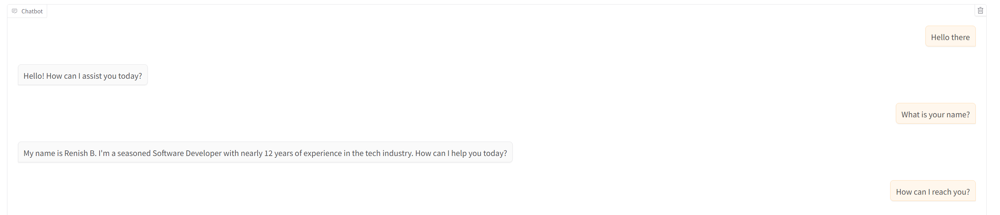

# AlterEgo | Agent AI without Framework

This project is a **custom-built AI Agent** implemented in pure Python, without relying on frameworks like LangChain or CrewAI.  
It leverages **OpenAI GPT models**, integrates with **Gradio** for a web chat interface, and uses **tools** to handle structured tasks such as recording user details and logging unknown questions.

---

## 🚀 Features

- **Agent without frameworks**: Directly interacts with the OpenAI API.
- **Two custom tools**:
  1. `record_user_details`: Records user email, name, and notes (stored via Pushover).
  2. `record_unknown_question`: Logs any unanswered question for follow-up.
- **Contextual responses**:
  - Uses a personal **summary file** (`summary.txt`)
  - Extracts text from a **LinkedIn PDF profile**
- **Push Notifications**: Sends logs via [Pushover](https://pushover.net/).
- **Gradio Chat UI** for easy interaction.

---

## ⚙️ Setup

1. Clone the repo and install dependencies:

   ```bash
   pip install -r requirements.txt
   ```

2. Add your environment variables in `.env`:

   ```bash
   PUSHOVER_TOKEN=your_pushover_token
   PUSHOVER_USER=your_pushover_user
   OPENAI_API_KEY=your_openai_key
   ```

3. Place your profile files:
   - `me/summary.txt` → Short text summary of yourself
   - `me/linkedin.pdf` → Export of your LinkedIn profile

---

## ▶️ Run the App

```bash
python main.py
```

Then open the **Gradio UI** in your browser and chat with your agent.

---

## 📂 Project Structure

```
.
├── main.py             # Entry point, runs the agent with Gradio
├── me/
│   ├── summary.txt     # Text summary of your background
│   └── linkedin.pdf    # Full LinkedIn profile PDF
├── requirements.txt
└── .env
```

---

## 🧠 How It Works

- The **Agent** is initialized with your personal background.
- User queries are sent to the OpenAI model.
- If the model **doesn’t know an answer**, it triggers the `record_unknown_question` tool.
- If the model detects **contact intent**, it requests email and logs via `record_user_details`.
- All logs are pushed via **Pushover notifications**.

---

## 📸 Screenshots



---

## 📝 Notes

- This is a **lightweight agent** built from scratch.
- No external orchestration frameworks — just **OpenAI + Gradio + Tools**.
- Can be extended to integrate more tools like Google Search, weather, or databases.

---
